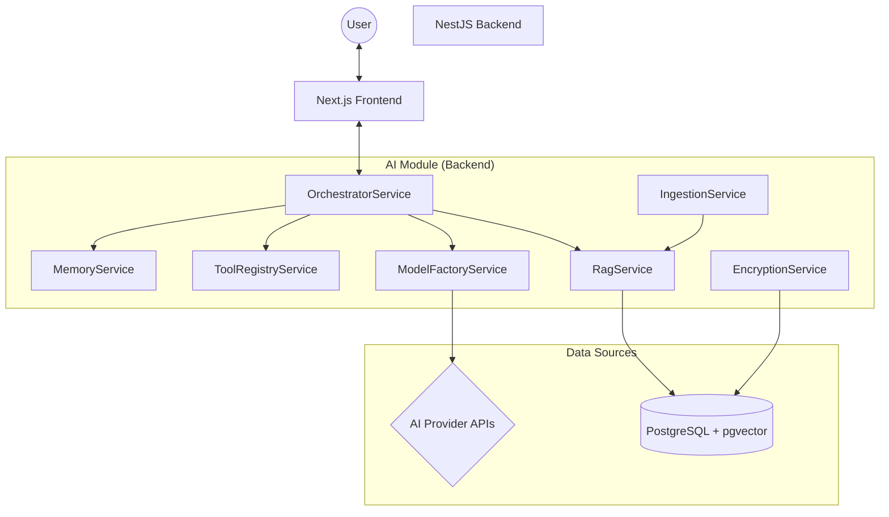
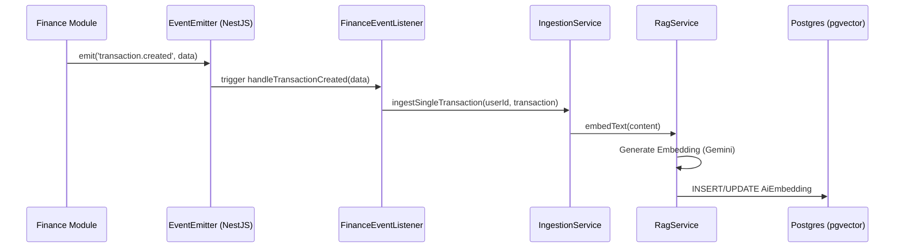
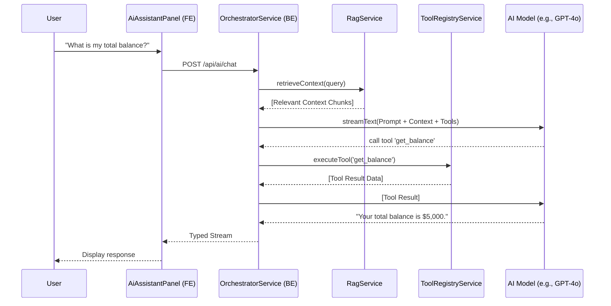

# AI Feature Technical Documentation

## Overview
The AI feature in the Personalization platform provides a context-aware assistant capable of managing finance, trading, and productivity data. It leverages Retrieval-Augmented Generation (RAG), long-term memory, and functional tool calling to provide a personalized experience.

## Architecture
The system follows a modular architecture using NestJS for the backend and Next.js for the frontend, integrated via the Vercel AI SDK.

## Backend Components

### 1. Orchestrator Service
The central entry point for AI interactions.
- **Context Retrieval**: Combines RAG results and recent user memories.
- **Model Selection**: Uses the `ModelFactoryService` to instantiate the appropriate provider model.
- **Tool Mapping**: Bridges internal tools to the Vercel AI SDK interface via `ToolRegistryService`.
- **Streaming**: Streams responses back to the frontend.

### 2. RAG & Ingestion System
Enables the AI to "know" the user's data without including the entire database in every prompt.
- **IngestionService**: Listens to domain events (e.g., `TRANSACTION_CREATED`) and converts records into searchable text chunks.
- **RagService**: Generates embeddings using `gemini-embedding-001` and performs similarity searches using pgvector (`<=>` operator).

### 3. Tool Registry
Exposes domain-specific functionality to the AI.
- **Finance Tools**: `get_balance`, `get_transactions`, `create_transaction`, etc.
- **Trading Tools**: `get_trading_logs`, `update_trading_log`, etc.
- **Memory Tools**: `save_memory`, `get_recent_memories`, `delete_memory`.

### 4. Event-Driven Ingestion
The system uses `@nestjs/event-emitter` to decouple the AI module from other business modules.
- **Listeners**: `FinanceEventListener` subscribes to finance-related events.
- **Flow**: When a transaction is created in the Finance module, an event is emitted. The AI module captures this event and asynchronously triggers the `IngestionService` to update the vector database.
- **Benefits**: This ensures the AI context is always up-to-date without blocking the main application logic.

### 5. Security & Configuration
- **EncryptionService**: AES-256-CBC encryption for user API keys stored in the database.
- **AiSettingsService**: Manages provider preferences (Google, OpenAI, Anthropic).

## Frontend Components

### 1. AI Assistant Panel
A persistent floating chat interface.
- **State Management**: Uses `@ai-sdk/react` for streaming and tool execution tracking.
- **Persistence**: Saves chat history and panel state (open/closed) to `localStorage`.
- **UI**: Supports markdown rendering and provides real-time feedback on tool execution statuses.

### 2. AI Configuration Page (`/ai`)
- **Provider Setup**: Interface to enter API keys and select models.
- **System Sync**: Manual trigger to index existing history into the vector database.

## Detailed Workflows

### Event-Driven Ingestion Workflow (RAG)
The AI system reacts to changes in the platform using an event-driven approach.

### AI Chat & Tool Execution Workflow

## Configuration Requirements
- `ENCRYPTION_KEY`: Must be set in backend environment variables for secure API key storage.
- AI Provider API Key: Must be configured by the user in the `/ai` settings page.
