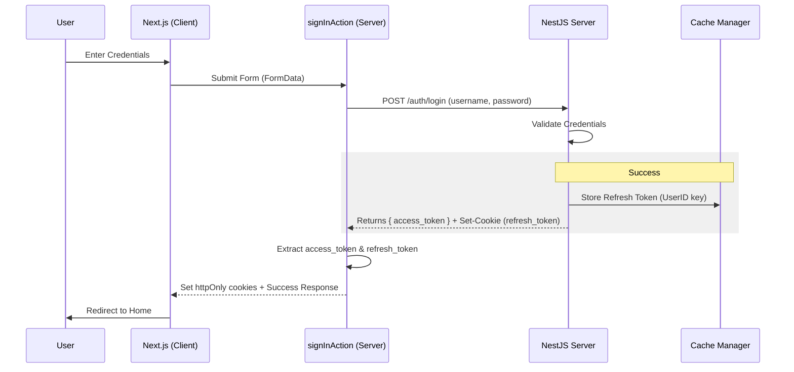
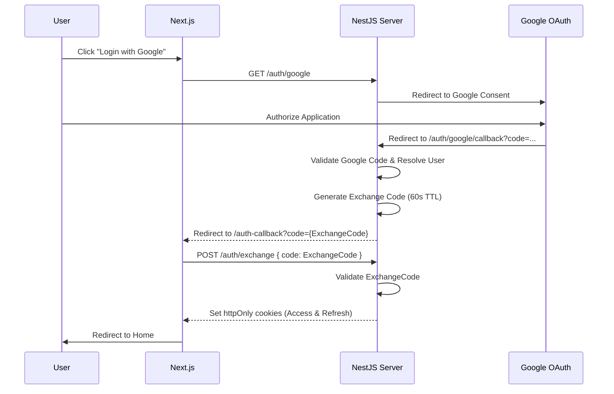
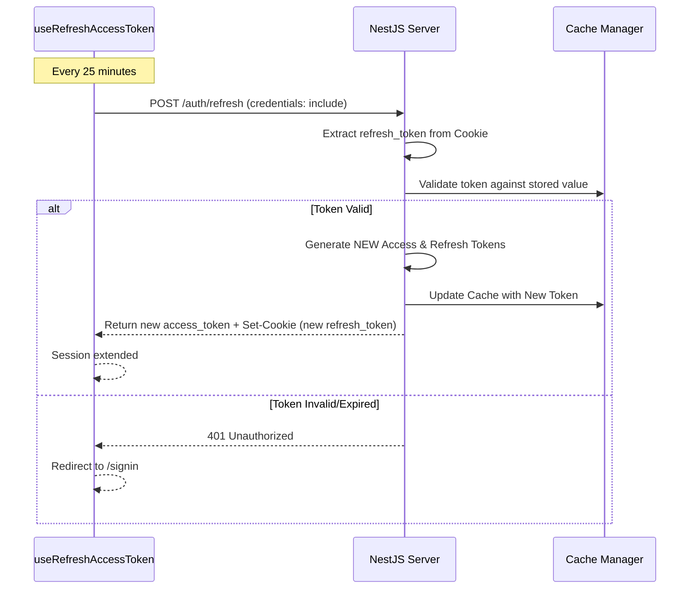

# Authentication Flow Overview

This document describes the authentication system used in the Personalization project. The system uses **JWT (JSON Web Tokens)** with a dual-token strategy (Access & Refresh) and supports both **Local (Email/Password)** and **Social (Google OAuth)** authentication.

---

## Technical Architecture

### Security Principles
- **Cookies**: Both Access and Refresh tokens are stored in `httpOnly`, `secure`, `sameSite: strict` cookies.
- **CSRF Protection**: Handled by `sameSite: strict` and `httpOnly` flags.
- **Token Isolation**: The `refresh_token` cookie is scoped specifically to the `/auth/refresh` path to minimize exposure.
- **XSS Prevention**: Since tokens are `httpOnly`, they cannot be accessed by client-side JavaScript.

### Token Strategy
- **Access Token**: Short-lived (duration varies by environment), used for API authorization.
- **Refresh Token**: Long-lived, stored in the backend cache (Redis/Cache Manager) and bound to a specific user session.

---

## 1. Local Login Flow

The local login flow uses Passport's `local` strategy on the backend and a Next.js Server Action on the frontend.

### Workflow Diagram

### Key Steps:
1. **Frontend**: The `signInAction` (Server Action) calls the backend.
2. **Backend**: Validates the user, generates both tokens, stores the refresh token in the cache, and sends the refresh token back as an `httpOnly` cookie.
3. **Frontend**: The Server Action forwards the `refresh_token` cookie and manually sets the `access_token` cookie for the browser.

---

## 2. Google OAuth Flow

Social authentication follows a "state-exchange" pattern to securely transfer tokens from the OAuth callback to the client cookies.

### Workflow Diagram

### Key Steps:
1. **Initiation**: The user is redirected to Google via the backend.
2. **Callback**: Google returns the user to the backend callback.
3. **Exchange Code**: To avoid exposing JWTs in the URL, the backend generates a short-lived, single-use `exchangeCode` and redirects the user back to the frontend with it.
4. **Exchange**: The frontend `AuthCallbackPage` sends this code back to the backend in a `POST` request, where the backend finalizes the session by setting the actual JWT cookies.

---

## 3. Session Maintenance (Token Refresh)

Session longevity is managed by a client-side hook that automatically refreshes the access token before it expires.

### Workflow Diagram

### Key Details:
- **`useRefreshAccessToken`**: Runs globally within `ApplicationContext`.
- **Token Rotation**: Every successful refresh generates a NEW refresh token and updates both the backend cache and the browser cookie. This provides a "sliding session" that stays active as long as the user is using the app.
- **Automatic Handling**: Because the `refresh_token` is an `httpOnly` cookie, the browser automatically includes it in the `/refresh` request and updates it via the `Set-Cookie` header.

---

## 4. API Authorization

The project uses two different API handlers depending on the execution context.

### Server-side (`ServerApi`)
- **Action**: Reads the `access_token` from cookies using `next/headers`.
- **Header**: Manually adds `Authorization: Bearer <token>` to the request.
- **Use Case**: Server Actions, Metadata fetching, SSR.

### Client-side (`ClientApi`)
- **Action**: Does **not** send an `Authorization` header.
- **Magic**: Uses `credentials: "include"` in the `fetch` request.
- **Result**: The browser automatically sends the `access_token` and `refresh_token` cookies. The backend `JwtStrategy` is configured to extract the token from cookies if the header is missing.

---

## Implementation Reference
- **Backend Controller**: `backend/src/modules/auth/auth.controller.ts`
- **Backend Strategy**: `backend/src/modules/auth/strategies/jwt.strategy.ts`
- **Frontend Hook**: `frontend/src/shared/hooks/useRefreshAccessToken.ts`
- **Frontend Action**: `frontend/src/app/(auth)/actions/login.ts`
